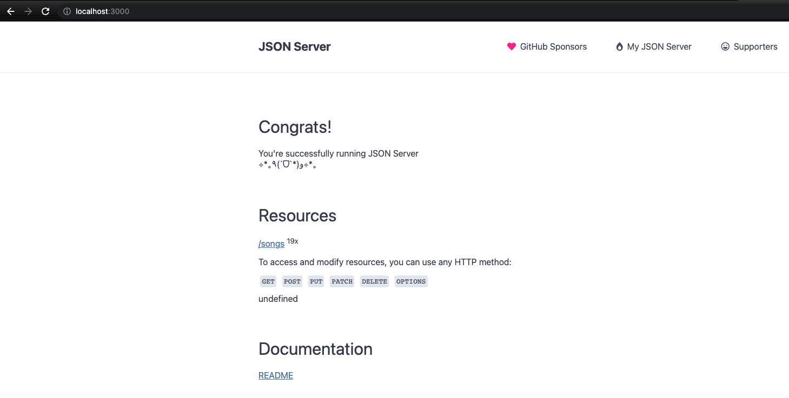
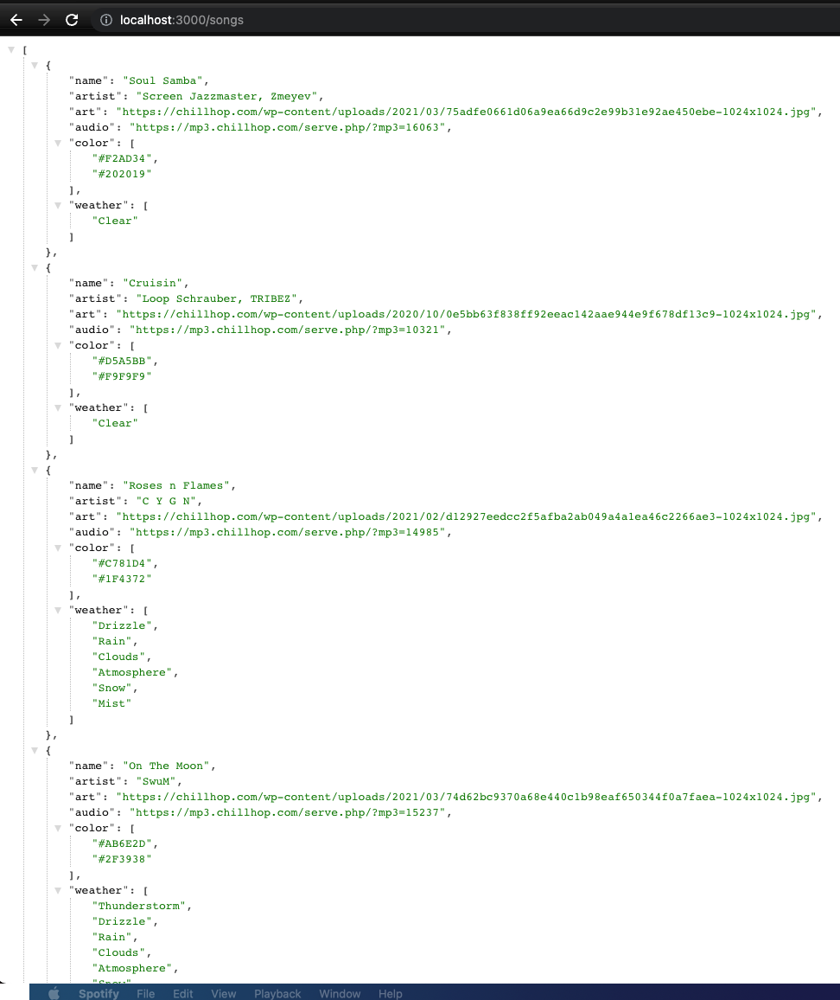
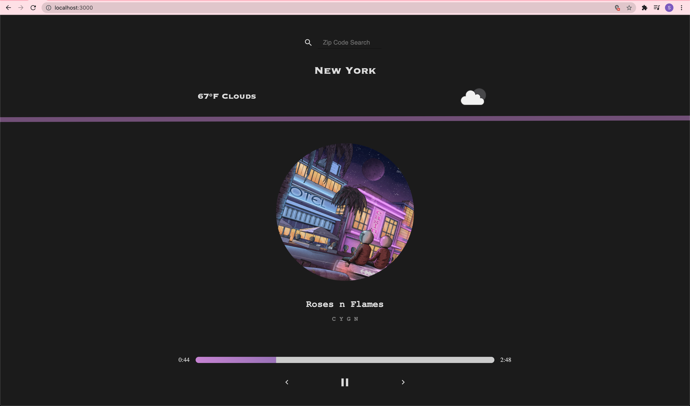
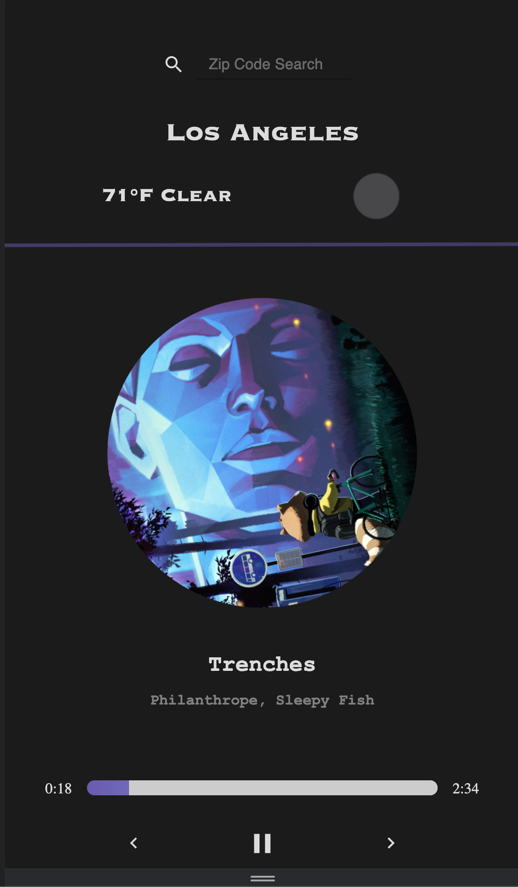

## Installation

1. Clone GitHub repo
2. Navigate into the `song-api` folder and type in `yarn install`
3. After that command has been run, type in `yarn start` (in the same folder) and navigate to `localhost:3000` to see:

   

4. (Optional) if you want to check if the api is working, go to `localhost:3000/songs` to see the data:

   

5. Navigate over to the `weather` project in your terminal, and type in `yarn install` to download the required packages for the client side
6. Type in `yarn start` (which will suggest to redirect you to `localhost:3001` since `3000` is occupied by the server, at the prompt type in `y` )
3. Then head over to `localhost:3001` in your web browser and you'll see this:
   
   

### Your local weather and corresponding music vibe is loaded first, and you can also search for different zip codes and the music playlist will reflect the mood of those weather conditions (mobile friendly too!):

