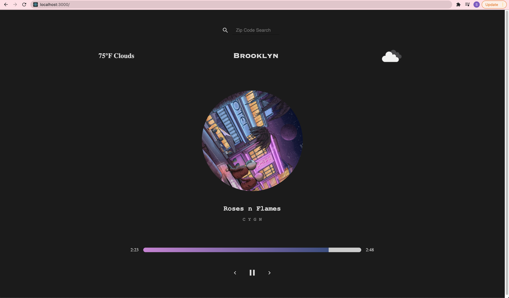

## Installation

1. Clone GitHub repo
2. Navigate to the `weather` project in your terminal, and type in `yarn install` to download the required packages
3. Then head over to `localhost:3000` in your web browser and you'll see this:
   
   

### Your local weather and corresponding music vibe is loaded first, and you can also search for different zip codes and the music playlist will reflect the mood of those weather conditions!